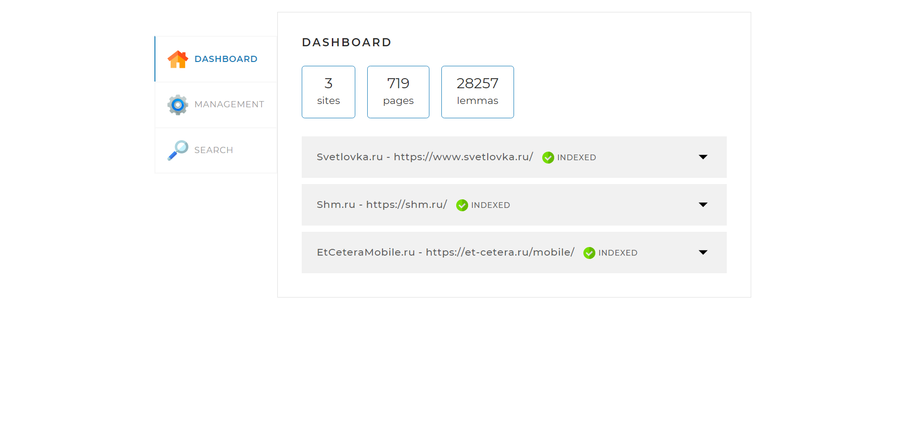

# SEARCH ENGINE

Приложение предназначено для осуществления парсинга выбранных сайтов с возможностью дальнейшего поиска 
по полученным с сайтов данным.
В качестве базы данных используется MySQL

#### Основные функции поискового движка:
* Парсинг страниц выбранных сайтов.
* Индексация страниц с записью в базу данных поисковых индексов.
* Осуществление поиска информации по ранее проиндексированным сайтам.

#### Используемые технологии, фреймворки, библиотеки:
Spring Data JPA, Spring MVC, ForkJoinPool, SQL, JSOUP, Apache Lucene

## Настройки для запуска
Для подключения проекта к базе данных необходимо создать бд `search_engine`, а также указать пользователя, пароль в файле конфигурации `src/resources/application.yaml`:
```yaml
spring:
  datasource:
    username: # имя
    password: # пароль
```
Для выбора сайтов для индексации необходимо их указать в файле конфигурации `src/resources/application.yaml`:
```yaml
indexing-settings:
sites:
    - url: https://nopaper.ru/
      name: NoPaper.ru
    - url: https://www.svetlovka.ru/
      name: Svetlovka.ru
    - url: https://shm.ru/
      name: Shm.ru
```
После этого, можете запустить проект. Если введены правильные данные,
проект успешно запуститься. Если запуск заканчивается ошибками, изучите текст
ошибок, внесите исправления и попробуйте заново.

## Работа программы

При успешном запуске проекта перейдите в браузере по адресу `http://localhost:8080/`
На странице будет отображаться интерфейс приложения

На странице доступно три вкладки:
* Dashboard
* Management
* Search

#### Вкладка DASHBOARD

На вкладке Dashboard выводится информация о сайтах, указанных в файле конфигурации.
Также возможно просмотреть информацию по каждому сайту отдельно.

#### Вкладка MANAGEMENT

На вкладке Management производится запуск полной индексации сайтов, указанных в файле конфигурации `src/resources/application.yaml`
при помощи кнопки `START INDEXING`, а также парсинг отдельной страницы при помощи кнопки `ADD/UPDATE`.

#### Вкладка SEARCH

На вкладке Search осуществляется поисковый запрос с выдачей результатов поиска